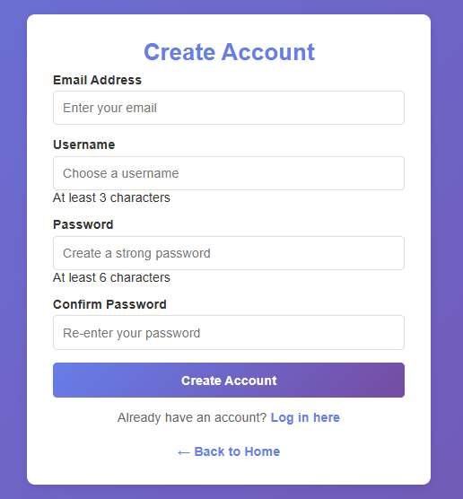
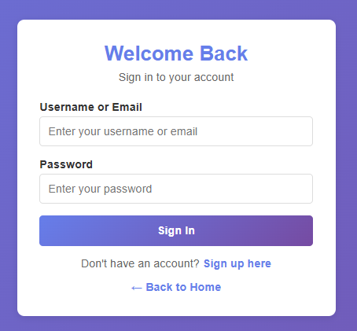

# Auth Application

A comprehensive PHP-based authentication and authorization system with user management and role-based access control.

## Features

- **User Registration**: Sign up with username, email, and password
- **User Login**: Secure login with session management
- **Role-Based Access Control**: Support for user and admin roles
- **Private Areas**: Protected pages accessible only to authenticated users
- **Admin Dashboard**: Comprehensive admin panel for user management
- **Logout Functionality**: Secure session termination
- **Database Initialization**: Automatic database and table creation on first run

## Installation & Setup

1. **Prerequisites**
   - PHP 7.0 or higher
   - MySQL/MariaDB server
   - Web server (Apache, Nginx, etc.)

2. **Database Configuration**
   - Edit database connection details in `index.php`:
     ```php
     $servername = "localhost";
     $username = "root";
     $password = "";
     $dbname = "mydba";
     ```

3. **Database Initialization**
   - Simply visit `index.php` in your browser
   - The application automatically creates the database and `Users` table if they don't exist

## Usage



### User Registration
1. Navigate to the signup page
2. Enter username, email, and password
3. Submit the form to create an account



### User Login
1. Go to the login page
2. Enter your username or email and password
3. Successfully authenticated users are redirected to the private area

### Access Control
- **Private Area** (`private.php`): Available only to logged-in users
- **Admin Dashboard** (`admin-dashboard.php`): Available only to users with admin role

### Logout
- Click the logout button to end your session and clear authentication cookies

## Security Features

- Session-based authentication
- Password hashing for secure storage
- Input validation and sanitization
- Protection against unauthorized access to admin areas
- Automatic redirection for unauthenticated users

## File Descriptions

- **index.php**: Initializes database and provides navigation
- **logIn.php**: Displays login form
- **signUp.php**: Displays registration form
- **private.php**: Protected user dashboard
- **admin-dashboard.php**: Admin control panel with user management capabilities
- **checkLogin.php**: Validates credentials and manages sessions
- **checkSignUp.php**: Processes new user registrations
- **logout.php**: Handles user logout and session cleanup
- **styles.css**: Consistent styling across all pages

## Techical Report
A technical report detailing the design and implementation of this authentication system can be found [here](TECHNICAL_REPORT.md).