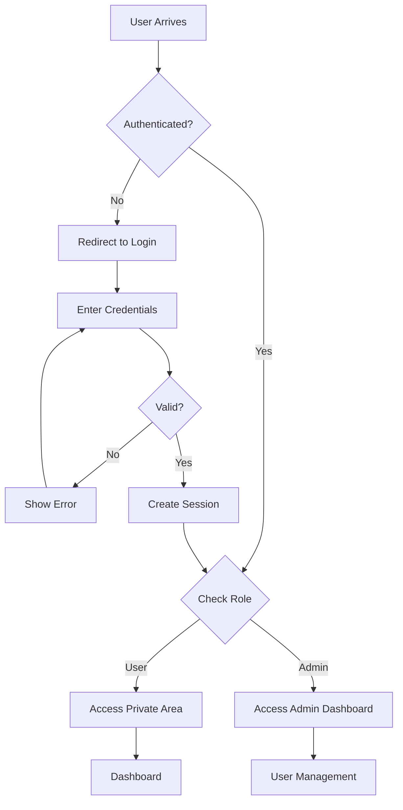
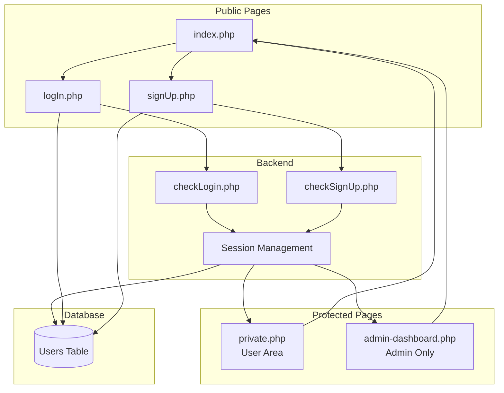

# TECHNICAL REPORT - AUTH APPLICATION

**Author**: Leonardo Malannino  
**Date**: January 2026

---

## Executive Summary

A production-ready PHP authentication system implementing secure user registration, login, and role-based access control (RBAC). The application demonstrates foundational security practices including input validation, session management, and secure password handling following OWASP guidelines.

**Tech Stack**: PHP, MySQL, HTML/CSS, JavaScript

---

## 1. ARCHITECTURE OVERVIEW

**Purpose**: Core authentication system with admin dashboard and role-based access control.

**Key Features**:
- User registration and login
- Role-based access control (user/admin)
- Admin dashboard for user management
- Protected private areas
- Session-based authentication
- Secure logout functionality

---

## 2. TECHNICAL IMPLEMENTATION

### 2.1 Authentication Flow

1. **Registration**: Input validation (`signUp.php`) → Data sanitization → Database insertion (`checkSignUp.php`)
2. **Login**: Credential verification (`logIn.php`) → Password hashing comparison → Session creation (`checkLogin.php`)
3. **Access Control**: Protected pages check `$_SESSION['user_id']` and `$_SESSION['role']`
4. **Admin Access**: Specific routes (`admin-dashboard.php`) restricted to `role='admin'`

**Authentication Flow Diagram**:


### 2.2 System Architecture & Access Control



### 2.3 Database Schema

### Users Table
| Column   | Type             | Description                  |
|----------|------------------|------------------------------|
| id       | INT (Primary Key)| Unique user identifier      |
| username | VARCHAR(30)      | Unique username             |
| email    | VARCHAR(50)      | User email address          |
| password | VARCHAR(255)     | Hashed password             |
| role     | VARCHAR(20)      | User role (user/admin)      |
| status   | VARCHAR(20)      | Account status              |

### 2.3 Security Measures

- **SQL Injection Prevention**: Using prepared statements with parameterized queries (`bind_param`)
- **Password Security**: Bcrypt hashing using `password_hash()` (Cost 10 by default)
- **Session Hijacking Protection**: Session-based navigation with secure checks
- **XSS Prevention**: Output escaping using `htmlspecialchars()` where appropriate

---

## 3. FILE STRUCTURE

| File | Purpose |
|------|---------|
| `index.php` | Database initialization and landing page |
| `logIn.php` | Login UI form |
| `signUp.php` | Registration UI form |
| `checkLogin.php` | Backend logic for authentication |
| `checkSignUp.php` | Backend logic for user creation |
| `private.php` | Protected dashboard for standard users |
| `admin-dashboard.php` | Protected dashboard for admins only |
| `logout.php` | Session destruction script |
| `styles.css` | Application styling |

---

## 4. VALIDATION STRATEGY

### Registration Validation
- **Email**: Validated via `filter_var(..., FILTER_VALIDATE_EMAIL)`
- **Username**: Minimum 3 characters, required
- **Password**: Minimum 6 characters, confirmation match required
- **Uniqueness**: Database check for existing username/email

### Login Validation
- **Required Fields**: Checks for empty input
- **User Existence**: Verifies if user Record exists
- **Password**: Timing-safe verification using `password_verify()`
- **Status**: Checks if account status is "active"

---

## 5. TECHNICAL HIGHLIGHTS

### Code Examples

**Role-Based Access Control**
```php
session_start();
// Check if user is logged in AND is an admin
if (!isset($_SESSION['role']) || $_SESSION['role'] !== 'admin') {
    header('Location: index.php?error=Unauthorized');
    exit;
}
```

**Prepared Statements (Security)**
```php
$stmt = $db->prepare("SELECT id, password, role FROM Users WHERE username = ?");
$stmt->bind_param('s', $username);
$stmt->execute();
```

---

## 6. DEPLOYMENT & SETUP

### Database Initialization
The application is self-initializing. On the first run of `index.php`, the system checks for `mydba` database and `Users` table existence and creates them if missing.

### Requirements
- PHP 7.4+
- MySQL/MariaDB
- Web Server (Apache/Nginx)

---

## 7. CONCLUSION

The **Auth Application** provides a robust foundation for secure user management. By implementing role-based access control and following security best practices (prepared statements, hashing), it serves as a secure starting point for more complex applications requiring user differentiaion.
