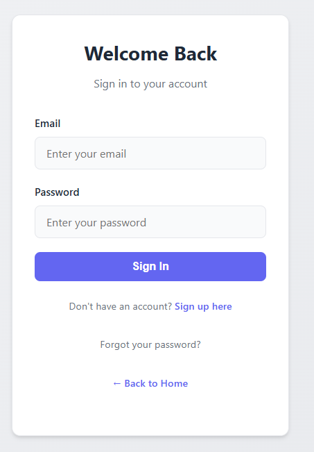
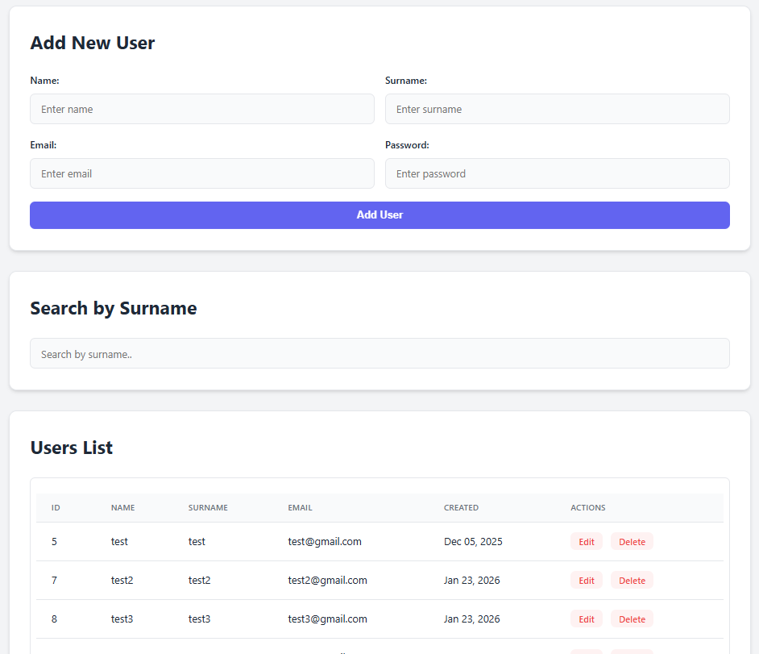

# Clients Management System

A secure, production-grade client management application with complete authentication and authorization features.

## Overview

- **User Authentication**: Secure login and registration system
- **Password Security**: Bcrypt hashing with salt
- **Session Management**: PHP session-based authentication with timeout
- **Password Recovery**: Email-based password reset functionality
- **Email Integration**: PHPMailer for transactional emails
- **Responsive Design**: Mobile-friendly interface
- **Security**: Input validation, CSRF protection, secure session handling

---

## Quick Start

### User Registration

1. Navigate to the signup page
2. Fill in required information (email, password, name)
3. Submit the form
4. Account is created and user is logged in automatically

### User Login

1. Enter email and password
2. Click "Login"
3. On success, redirected to dashboard
4. Session maintained for 30 minutes of inactivity

### Password Reset

1. Click "Forgot Password" on login page
2. Enter registered email address
3. Check email for reset link
4. Click link and enter new password
5. Password is updated securely

---

## Screenshots

### Login Interface

*Clean and intuitive login interface with validation*

### Clients-Dashboard

*Secure client management interface with personalized content*

---

## Contributing

Contributions are welcome! Please follow these guidelines:

1. Fork the repository
2. Create a feature branch
3. Make your changes with clear commit messages
4. Test thoroughly
5. Submit a pull request

---

## License

This project is part of the ps-malannino-leonardo portfolio.

---

## Author

**Leonardo Malannino**  
Email: leonardo.malannino@isisbem.it

---

## Changelog

### Version 1.0.0
- Initial release
- User authentication system
- Password recovery functionality
- Session management
- Email integration
- Responsive design

---

## Technical Documentation

For detailed technical information, architecture diagrams, implementation details, database schema, and troubleshooting guide, please refer to [TECHNICAL_REPORT.md](TECHNICAL_REPORT.md).
