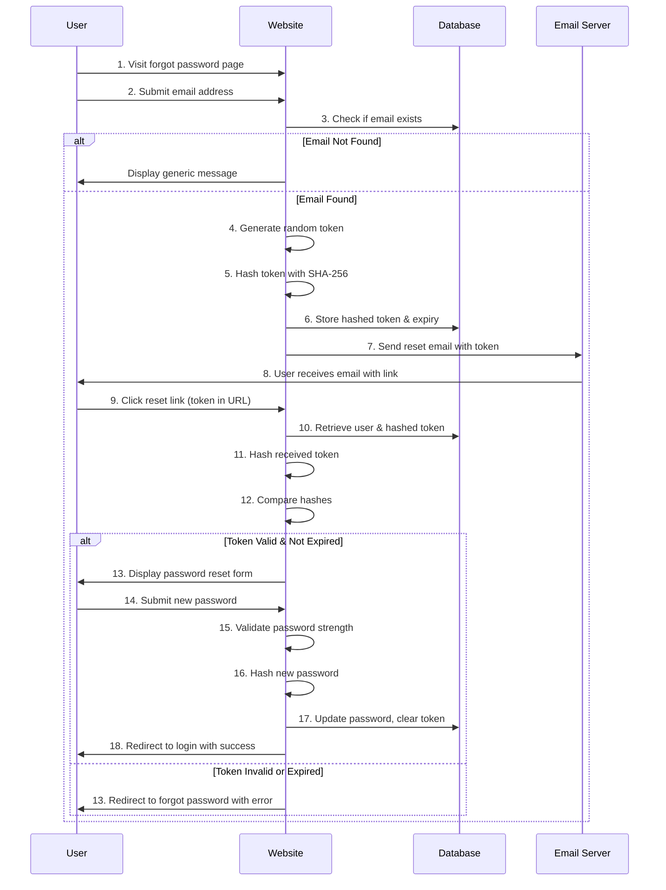

# TECHNICAL REPORT - CLIENTS APPLICATION

**Author**: Leonardo Malannino  
**Date**: January 2026

---

## Executive Summary

An advanced, object-oriented PHP application demonstrating professional software architecture patterns. Key features include a robust authentication system, secure password recovery via email, and adherence to SOLID principles using Singleton, Data Mapper, and Strategy patterns.

**Tech Stack**: PHP 7.4+ (OOP), MySQL 5.7+, PHPMailer, HTML5, CSS3

---

## 1. ARCHITECTURE OVERVIEW

**Purpose**: Advanced management system with OOP architecture, password recovery, and email integration.

**Key Features**:
- Object-Oriented Design (Classes & Interfaces)
- Secure Login & Registration
- Password Recovery (Forgot/Reset Password)
- Email Notifications (PHPMailer)
- Input Validation Engine
- Singleton Database Connection

---

## 2. TECHNICAL IMPLEMENTATION

### 2.1 Password Recovery Flow

The password recovery system implements a secure token-based reset mechanism with the following detailed workflow:

#### Step-by-Step Process

**1. Password Reset Initiation** (`forgotPassword.php`)
- User accesses the forgot password page and enters their registered email address
- Form validation ensures email format is correct
- Database is queried to verify if the email exists in the system
- If email not found, a generic message is displayed (security practice to prevent user enumeration)

**2. Token Generation and Storage**
- A cryptographically secure random token is generated using `bin2hex(random_bytes(32))`
- Token length: 64 characters (hex-encoded 32 bytes)
- Token is hashed using SHA-256 before storage in database (prevents compromise if database is breached)
- Expiration timestamp is set to current time + 1 hour (configurable in `config.php`)
- Both hashed token and expiration time are stored in `reset_token` and `reset_token_expires` columns
- Original (unhashed) token is emailed to user

**3. Email Delivery** (PHPMailer Integration)
- Email contains a reset link: `resetPassword.php?token=<original_token>&email=<user_email>`
- Email includes expiration warning (e.g., "This link expires in 1 hour")
- Email is sent from configured SMTP server via `phpmailer/mailSender.php`
- Fallback mechanism: if email fails, user is notified to retry or contact support

**4. Token Verification** (`resetPassword.php`)
- User receives email and clicks the reset link
- System retrieves token from GET parameter
- Database lookup: find user by email from GET parameter
- Hash the received token and compare with stored hashed token using `hash_equals()` (prevents timing attacks)
- Verify token hasn't expired: `reset_token_expires > NOW()`
- If token is invalid or expired, user is redirected to forgot password page with error message

**5. Password Reset Execution**
- If token is valid, user is presented with new password form
- New password must meet requirements: min 8 characters, 1 uppercase, 1 lowercase, 1 number, 1 special character
- Password is validated using `Validator` class
- Validated password is hashed using `password_hash($password, PASSWORD_BCRYPT)`
- Password is updated in database
- Reset token and expiration are cleared (set to NULL) to prevent reuse
- User is redirected to login page with success message

**6. Security Cleanup**
- Token is deleted after successful reset
- Multiple failed attempts can trigger account lockout (optional enhancement)
- Reset activity is optionally logged for audit trail

#### Mermaid Flow Diagram




---

## 2. FILE STRUCTURE

```
Clients/
├── .htaccess                          # Server rewrite rules & environment configuration
├── .htaccess copy                     # Blank .htaccess template for deployment
├── index.php                          # Application entry point
├── config.php                         # Database & application configuration
├── db_connection.php                  # Database connection helper
├── logIn.php                          # Login page (view)
├── signUp.php                         # Registration page (view)
├── forgotPassword.php                 # Password recovery request page
├── resetPassword.php                  # Password reset form & execution
├── clients-dashboard.php              # Main authenticated dashboard
├── private.php                        # Protected resource example
├── checkLogin.php                     # Login authentication controller
├── checkSignUp.php                    # Registration validation controller
├── logout.php                         # Session termination
├── styles.css                         # Global styling
├── README.md                          # Project documentation
├── TECHNICAL_REPORT.md                # This file
├── classes/                           # Object-oriented classes
│   ├── Database.php                   # Singleton database connection manager
│   ├── User.php                       # User model with data mapping
│   └── Validator.php                  # Input validation & sanitization
├── phpmailer/                         # Email handling library
│   ├── PHPMailer.php                  # PHPMailer main class
│   ├── SMTP.php                       # SMTP communication handler
│   ├── Exception.php                  # PHPMailer exceptions
│   ├── mailSender.php                 # Email sending logic
│   └── mail_services.md               # Email configuration guide
└── media/                             # Images & screenshots
    ├── clients-dashboard.png          # Dashboard screenshot
    └── login.png                      # Login page screenshot
```

---

## 3. DATABASE SCHEMA

**Users Table**:
- Stores user account information and password reset tokens
- Columns: `id`, `email`, `password`, `first_name`, `last_name`, `created_at`, `reset_token`, `reset_token_expires`

**Key Features**:
- Email is marked as UNIQUE to prevent duplicate accounts
- Password stored as bcrypt hash (never stored in plaintext)
- Reset token columns support secure password recovery workflow
- Timestamps track account creation and modifications

---

## 4. DATABASE MANAGEMENT

### Initialization
The application uses a self-check mechanism in `config.php` to ensure the database and required tables exist before any operation is attempted.

### Connection
Managed via the `Database` singleton class, ensuring efficient connection reuse and centralized credentials management.

---

## 5. INSTALLATION & CONFIGURATION

### Prerequisites

- PHP 7.4 or higher
- MySQL 5.7 or higher
- Web server (Apache/Nginx) or PHP built-in server
- Composer (optional, for PHPMailer updates)

### Setup Steps

1. **Clone or download the repository**

2. **Configure database settings**
   
   Edit `config.php` with your database credentials:
   ```php
   $servername = "localhost";
    $username = "root";
    $password = "";
    $dbname = "mydba";
   ```

3. **Create database tables**

   Run the SQL schema:
   ```sql
   CREATE TABLE users (
       id INT AUTO_INCREMENT PRIMARY KEY,
       email VARCHAR(255) UNIQUE NOT NULL,
       password VARCHAR(255) NOT NULL,
       first_name VARCHAR(100),
       last_name VARCHAR(100),
       created_at TIMESTAMP DEFAULT CURRENT_TIMESTAMP,
       updated_at TIMESTAMP DEFAULT CURRENT_TIMESTAMP ON UPDATE CURRENT_TIMESTAMP
   );

   CREATE TABLE password_resets (
       id INT AUTO_INCREMENT PRIMARY KEY,
       user_id INT NOT NULL,
       token VARCHAR(255) NOT NULL,
       expires_at TIMESTAMP NOT NULL,
       used BOOLEAN DEFAULT FALSE,
       created_at TIMESTAMP DEFAULT CURRENT_TIMESTAMP,
       FOREIGN KEY (user_id) REFERENCES users(id) ON DELETE CASCADE
   );
   ```

4. **Configure email settings** (in `phpmailer/mailSender.php`)

5. **Start the development server**
   ```bash
   php -S localhost:8000
   ```

6. **Access the application**
   
   Open your browser and navigate to `http://localhost:8000`

---

## 6. SESSION TIMEOUT CONFIGURATION

Default: 30 minutes. To modify, edit the session timeout in `checkLogin.php`:

```php
define('SESSION_TIMEOUT', 1800); // 30 minutes in seconds
```

---

## 6. PASSWORD REQUIREMENTS

- Minimum 8 characters
- At least one uppercase letter
- At least one lowercase letter
- At least one number
- At least one special character

---

## 7. CONCLUSION

The **Clients Application** represents a professional approach to PHP development. By leveraging Object-Oriented Programming and established design patterns, it achieves high maintainability, testability, and security. The inclusion of a secure password recovery flow demonstrates readiness for real-world user management scenarios.
