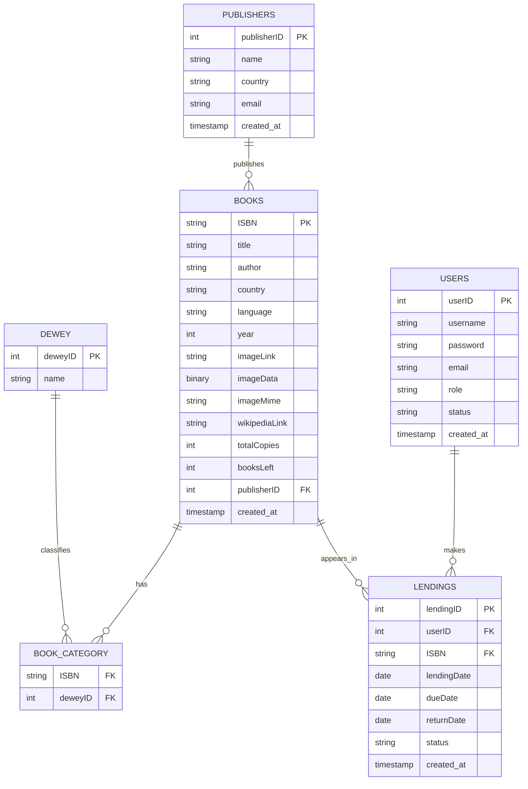
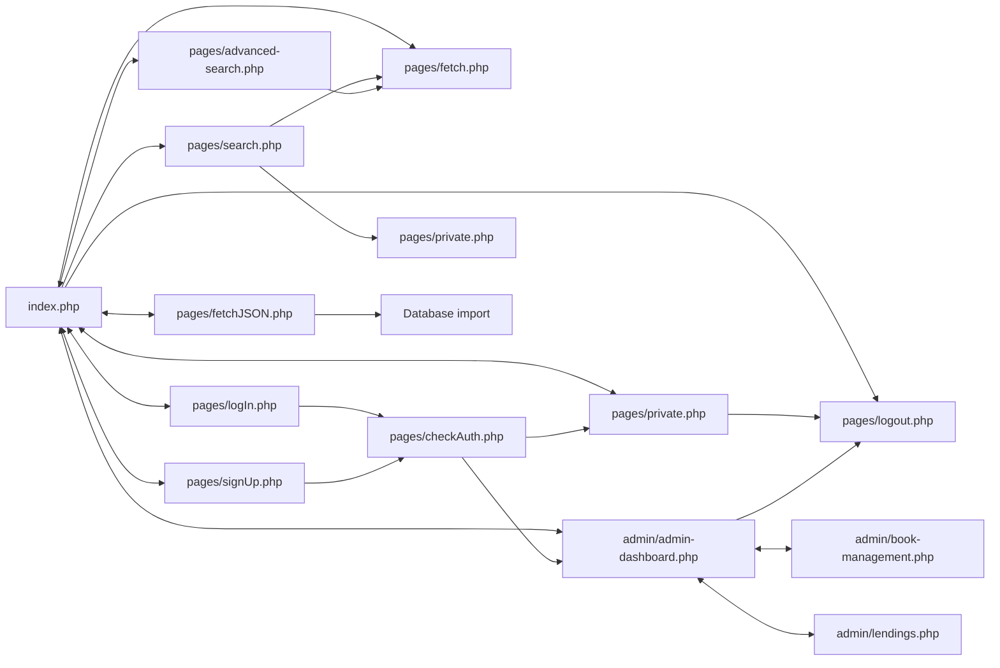

# TECHNICAL REPORT - LIBRARY APPLICATION

Author: Leonardo Malannino  
Date: April 2026

## Executive Summary

Library is a web-based catalog and lending platform built with PHP and MySQL. It combines catalog search and Dewey classification with account management, role-based access, an approval-based lending lifecycle, overdue reminders, and inventory tracking.

Tech Stack: PHP 7.4+, MySQL 5.7+, HTML5, CSS3

## 1. Architecture Overview

Purpose: manage books, user accounts, and borrow/return workflows with real-time stock values.

Main Modules:

- Catalog module: search and filter books with multi-category Dewey support and ISBN detail pages.
- Auth module: sign up, log in, log out, session persistence.
- Data access: centralized in `pages/config.php` exposing a PDO-based connection and schema initializer; pages use prepared statements and transactions via PDO where appropriate.
- User operations: request lendings by choosing a lending duration.
- Admin operations: confirm lendings, register returns, monitor lending activity, and inspect top-borrowed books.
- Media module: import and render cover images from LONGBLOB fields.

## 2. Functional Scope

### 2.1 Catalog and Search

- Server-side filtering over title, author, ISBN, publisher, language, country, and categories.
- Search results display current availability from the BookAvailability view.
- Each book opens a dedicated ISBN page with detailed metadata and borrow controls.

### 2.2 Authentication and Roles

- Registration endpoint creates user accounts with password hashing.
- Login endpoint accepts username or email.
- Session stores user_id, username, and role.
- Role-based routing:
    - admin -> admin/admin-dashboard.php
    - user -> pages/private.php

### 2.3 Lending Workflow

- User starts lending from the book detail page and chooses a duration (7, 14, 21, or 30 days).
- Borrow request reads the current stock from the BookAvailability view before creating a lending request.
- Borrow prevents duplicates for active user-book pair.
- New requests are created with status pending and a dueDate based on selected duration.
- Admin confirms requests (status pending -> confirmed).
- Only admin can register the return (status confirmed -> returned); the view then recomputes availability from the lending history.
- Outcomes are surfaced as success/error UI messages in dashboards.

### 2.4 Overdue Warning Banner

- From the day after dueDate, users with confirmed unreturned lendings see a warning banner across user pages.
- Banner is available on Home, Search, Advanced Search, and User Dashboard pages.
- Banner can be closed by the user and is hidden for 2 days via localStorage.
- If the lending is still overdue after 2 days, the banner reappears automatically.
- If the lending is still overdue after 10 days, the banner becomes permanently visible until the book is returned.

### 2.5 Admin Monitoring

- Total lendings
- Pending count
- Confirmed count
- Returned count
- Book title count, total copies, and available copies
- Top 10 most borrowed books

## 3. File Structure

```
Library/
├── index.php                  # Homepage
├── assets/
│   └── media/
│       ├── book-images/       # Legacy/seeded cover files
│       └── images/            # General UI images
├── components/
│   ├── admin-sidebar.php      # Shared admin navigation
│   ├── header.php             # Shared header/navbar
│   └── footer.php             # Shared footer
├── admin/
│   ├── admin-dashboard.php    # Admin overview page
│   ├── book-management.php    # Admin catalog CRUD
│   └── lendings.php           # Admin lending actions
├── pages/
│   ├── config.php             # DB connection + setup (centralized PDO connection and schema/view initializer)
│   ├── fetch.php              # Catalog query endpoint
│   ├── checkAuth.php          # Login/signup handler
│   ├── search.php             # Catalog search page
│   ├── book-details.php       # Book details by ISBN
│   ├── advanced-search.php    # Advanced filtering page
│   ├── fetchJSON.php          # JSON import utility
│   ├── logIn.php              # Login page
│   ├── signUp.php             # Registration page
│   ├── logout.php             # Logout endpoint
│   └── private.php            # User dashboard
├── data.json                  # Seed data
├── styles.css                 # Global styles
├── script.js                  # Shared JS helpers
├── .htaccess                  # Rewrite rules (/search/...)
├── TECHNICAL_REPORT.md        # Technical documentation
└── README.md                  # Project overview
```

## 3.1 Reusable PHP Includes (Header/Footer)

To reduce duplicated layout code, header and footer were extracted into reusable include files:

- `components/header.php`
- `components/footer.php`

Implementation details:

- Pages define local configuration arrays (`$headerLinks`, `$footerLinks`) before the include.
- `header.php` reads contextual values such as `$activePage`, `$isLoggedIn`, `$isAdmin`, and `$showContactLink` to render the correct navigation state and user actions.
- `footer.php` supports configurable page links and optional section id via `$footerId` (used for `#contact` anchoring on pages that need it).
- Root and nested pages use different relative include paths:
    - `index.php` uses `require __DIR__ . '/components/...';`
    - files in `pages/` use `require __DIR__ . '/../components/...';`

The admin area now also uses a shared sidebar include for the three-page dashboard shell.

This approach keeps presentation consistent across pages while keeping routing and page-specific content in each page file.

## 4. Database Schema

Database: malannino_db

### Publishers

| Column | Type | Key | Notes |
|---|---|---|---|
| publisherID | INT(6) UNSIGNED AUTO_INCREMENT | PK | Publisher identifier |
| name | VARCHAR(255) | - | Publisher name |
| country | VARCHAR(100) | - | Publisher country |
| email | VARCHAR(255) | - | Nullable |
| created_at | TIMESTAMP | - | Default CURRENT_TIMESTAMP |

### Books

| Column | Type | Key | Notes |
|---|---|---|---|
| ISBN | VARCHAR(20) | PK | Book identifier |
| title | VARCHAR(255) | - | Book title |
| author | VARCHAR(255) | - | Book author |
| country | VARCHAR(100) | - | Country of origin |
| language | VARCHAR(100) | - | Book language |
| year | INT(4) | - | Publication year |
| imageLink | VARCHAR(255) | - | Nullable legacy path (migration fallback) |
| imageData | LONGBLOB | - | Nullable binary cover image |
| imageMime | VARCHAR(100) | - | MIME type for imageData |
| wikipediaLink | VARCHAR(255) | - | Nullable |
| BookAvailability.totalCopies | INT(11) | - | Total copies (view) |
| BookAvailability.booksLeft | INT(11) | - | Available copies (view) |
| publisherID | INT(6) UNSIGNED | FK | References Publishers(publisherID) |
| deweyID | INT(6) UNSIGNED | FK | Nullable legacy field |
| created_at | TIMESTAMP | - | Default CURRENT_TIMESTAMP |

### Dewey

| Column | Type | Key | Notes |
|---|---|---|---|
| deweyID | INT(6) UNSIGNED | PK | Category identifier |
| name | VARCHAR(255) | - | Category label |

### BookCategory

| Column | Type | Key | Notes |
|---|---|---|---|
| ISBN | VARCHAR(20) | PK, FK | References Books(ISBN) |
| deweyID | INT(6) UNSIGNED | PK, FK | References Dewey(deweyID) |

### Users

| Column | Type | Key | Notes |
|---|---|---|---|
| userID | INT(6) UNSIGNED AUTO_INCREMENT | PK | User identifier |
| username | VARCHAR(255) | UNIQUE | Login name |
| password | VARCHAR(255) | - | Hashed password |
| email | VARCHAR(255) | UNIQUE | User email |
| role | ENUM('admin','user') | - | Default 'user' |
| status | ENUM('active','inactive') | - | Default 'active' |
| created_at | TIMESTAMP | - | Default CURRENT_TIMESTAMP |

### Lendings

| Column | Type | Key | Notes |
|---|---|---|---|
| lendingID | INT(6) UNSIGNED AUTO_INCREMENT | PK | Lending identifier |
| userID | INT(6) UNSIGNED | FK | References Users(userID) |
| ISBN | VARCHAR(20) | FK | References Books(ISBN) |
| lendingDate | DATE | - | Borrow date |
| returnDate | DATE | - | Nullable until returned |
| status | ENUM('borrowed','returned') | - | Default 'borrowed' |
| created_at | TIMESTAMP | - | Default CURRENT_TIMESTAMP |


### 4.1 Availability View Model

The application no longer stores `totBooks` and `booksLeft` inside the `Books` table. Instead, `config.php` creates a SQL view named `BookAvailability` that behaves like a live inventory snapshot.

How it works:

- Each book is given a default base stock of 3 copies in the view.
- The view counts active lendings for the same ISBN, using only `pending` and `confirmed` rows from `Lendings`.
- `totalCopies` is the fixed base stock exposed by the view.
- `booksLeft` is calculated as `totalCopies - active lendings`, never going below 0.
- Because the values are computed at read time, returning a lending or creating a new active lending changes the visible availability immediately without updating `Books`.

This design keeps the catalog table focused on book metadata while letting lending activity act as the source of truth for stock availability.

### 4.2 Entity Relationships



### 4.3 Key Additions

- Books now exposes inventory through the BookAvailability view instead of storing totBooks and booksLeft.
- Users table introduced for account and role management.
- Lendings table includes dueDate and status lifecycle (pending, confirmed, returned).
- Existing BookCategory table retained for many-to-many Dewey mapping.
- Book cover files are now imported into Books.imageData as LONGBLOB, with Books.imageMime storing the MIME type.

## 5. Page Flow



## 6. Integrity and Safety Considerations

- Passwords are verified with password_verify and stored hashed.
- Borrow and return operations execute in transactions.
- Stock modification happens with row lock to reduce race conditions.
- Users cannot borrow same book twice while active lending exists.
- Lending duration is validated server-side against allowed values.
- Admin-only return flow prevents users from closing lendings directly.
- Inactive accounts are blocked from login.
- Password creation is validated both client-side and server-side with a stricter policy.

## 7. Conclusion

The application now covers catalog discovery and a controlled lending lifecycle with request approval and overdue awareness. The updated schema and role-aware flows provide a stronger foundation for future features such as reservation queues, penalties, auditing, and reminder escalation.

The latest revision also improves maintainability by consolidating auth handling, storing cover images in the database, and documenting how the user-facing pages connect to one another.
